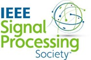
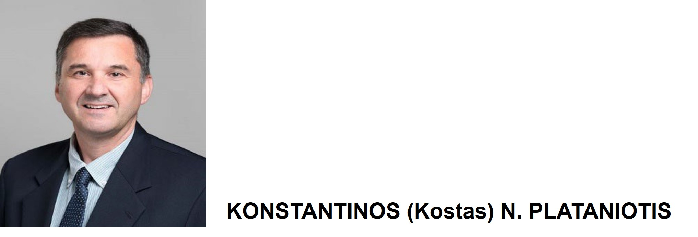

<figure markdown>
  
  <!-- <figcaption>Image caption</figcaption> -->
</figure>
  <h3 style="text-align: center; margin-top: -1%"><u>IEEE Signal Processing Society President-Elect (2024-2025)</u></h3>

Short Bio: Konstantinos N. Plataniotis received his B.Eng. degree in Computer Engineering from the University of Patras, Greece, followed by an M.S. and Ph.D. in Electrical Engineering from the Florida Institute of Technology in Melbourne, Florida. He is presently a Professor at The Edward S. Rogers Sr. Department of Electrical and Computer Engineering, University of Toronto, Canada, where he directs the Multimedia Laboratory. He has held the Bell Canada Endowed Chair in Multimedia since 2014. Dr. Plataniotis is a registered professional engineer in Ontario and a Fellow of IEEE, the Engineering Institute of Canada, and the Canadian Academy of Engineering/ L'Academie Canadienne Du Genie. His primary research areas include image/signal processing, machine learning and adaptive learning systems, visual data analysis, multimedia and knowledge media, and affective computing. 

Contact Information:

Professor and Bell Canada Chair in Multimedia  
University of Toronto, ON, M5S3G4, CANADA   
T: +1 416 946 5605; F: +1 416 978 4425   
E: kostas@ece.utoronto.ca, kostas.plataniotis@utoronto.ca  
W: www.comm.utoronto.ca/~kostas  
L: https://plataniotis.my.canva.site/  

IEEE Signal Processing Society, President-Elect (2024-2025)  
W: https://signalprocessingsociety.org/  
W: www.plataniotis.com  
E: k.n.plataniotis@ieee.org  

 
