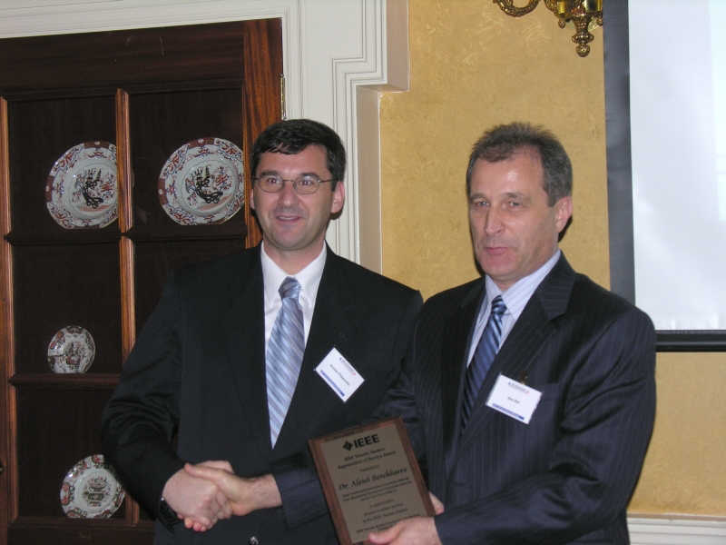
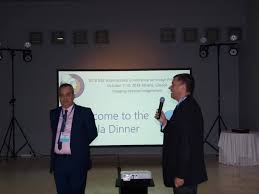
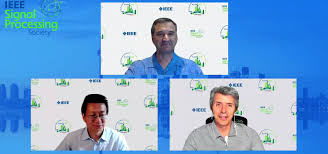
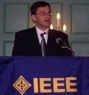
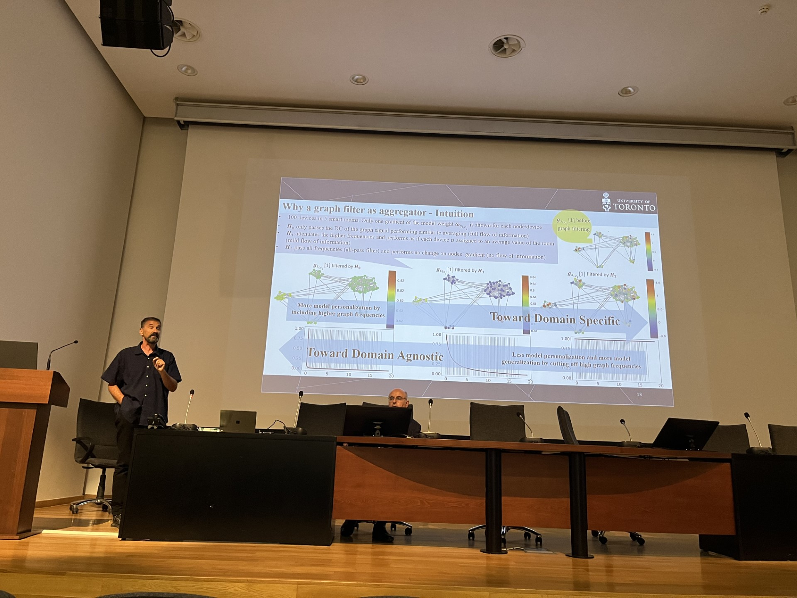
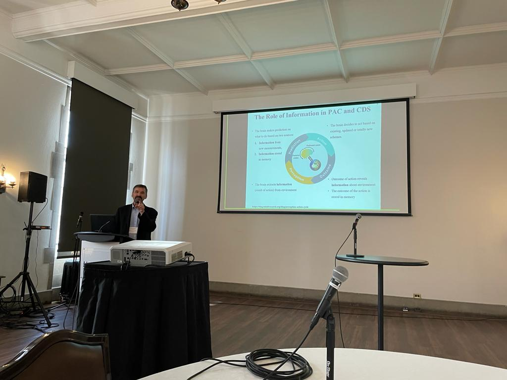

<!-- 

    

    </img>
    

 -->
### Dear colleagues,

This year’s [IEEE Signal Processing Society](https://signalprocessingsociety.org/) election has started. As an SPS-nominated candidate for the SPS President-elect position, I am honoured to have the opportunity to serve you and our SPS community. 

I have been an SPS member for over 30 years and have served SPS in many roles, including inaugural VP-Membership, Editor-in-Chief, and General Co-Chair for its flagship conferences. I aim to empower our SPS members to advance their careers, increase our appeal to the industry and service to industry professionals, further promote our technical excellence, and improve operational efficiency.

<!-- [Vote Me! :fontawesome-solid-paper-plane:](#){ .md-button .md-button--primary } -->

!!! success ""

<!-- Photo Grid -->

 
  

    
    
  

  

    
    
  
  
  

    
    
  

## **Who am I?**
  
**IEEE:** I have served as the inaugural Vice President membership for the Signal Processing Society (2013-2016), IEEE Signal Processing Letters Editor-in-Chief (2009-2011), 2017 GlobalSIP, 2018 International Conference on Image Processing (ICIP2018), and 2021 IEEE International Conference on Acoustics, Speech and Signal Processing (ICASSP2021) co-Chair.  I serve as the co-Chair for ICASSP2027.  During my tenure as Vice President, SPS membership has constantly increased, especially in student and graduate student grades; many member-driven initiatives were introduced, and most of our affinity groups were established. 

**Entrepreneur:**  I am a registered professional engineer with first-hand engagement and a keen appreciation of industry and academia. I co-founded Medical Cytometrix Inc. My research led to technology commercialization, including intellectual property transfer to industry, patents licensing (machine intelligence start-up), HURON Digital Pathology (computational pathology), and Canadian government (Crown – Department of National Defence, Canada). 

**Professor:** I am a Fellow of the Canadian Academy of Engineering and the Bell Canada Chair Professor in Multimedia since 2014 at the University of Toronto (UofT), which ranks in the top 20 global research universities. I am the Director for the Machine Intelligence Major at UofT’s elite Engineering Science program. My research group conducts research encompassing broad areas of machine learning, adaptive systems, image processing, and biomedical signal processing. 

**Awards/Honors:** I am humbled to see my work capturing the attention of my peers (Google Scholar: Citations: 28,000 +, h-index: 81, i10-index:350). Research.com recognizes me as a leading researcher, ranked 550 globally and 33 in electrical and electronics engineering in Canada. I also rank 913 globally and 34 in Canada in computer science (2023 Edition). I am a Fellow of IEEE, a Fellow of the Engineering Institute of Canada, and a Fellow of the Canadian Academy of Engineering. I received the J.M. Ham IEEE Canada Outstanding Engineering Educator Award, the 2006 IEEE Trans. on Neural Networks Best Paper Award and a 2018 IET paper award.

!!! success ""

## **Why am I running?**
The IEEE Signal Processing Society has been my professional home since 1991, and I have always cherished the opportunity to continue serving our community. I understand the challenges we face in our professional lives: being students, working in academia, leading in the industry, or charging ahead as entrepreneurs.

!!! success ""

## **What do I plan to do?**
I will focus on the following: 

!!! success "Serve our members – enhance membership benefits with new offerings and services."

    - [x] Develop personalized activities and services to accommodate divergent needs across geographical regions, industries, and career stages.
    - [x] Engage practicing engineers and better engage industry members; establish public forums to exchange ideas, data, and research artifacts.
    - [x] Combine networking and mentoring programs with personalized education packages.
    - [x] Establish microlearning opportunities and stackable credentials in emerging areas of interest. 
    - [x] Expand our mentoring programs to underserved areas and underrepresented groups in our community.

!!! success "Support our volunteers – enhance the value proposition with new offerings and services."

    - [x] Increase diversity among our volunteers, incentivize and recognize them. 
    - [x] Facilitate collaboration with sister societies and other IEEE units with shared interests.
    - [x] Shorten the submission-to-publication review cycle for all our publications through emerging technologies while maintaining our technical excellence. 
    - [x] Engage early career professionals and recruit industry-based professionals in our technical publications and conference portfolios.
    - [x] Enhance openness and fairness by ensuring transparency in all decision-making processes.

!!! success "Secure our future - look ahead to SPS’s 100th anniversary. "

    - [x] Stay abreast with new and future technologies and theories.
    - [x] Develop infrastructure to allow SPS to capitalize on emerging technology trends.
    - [x] Ensure long-term viability by continuing to operate in a self-sustainable way.
    - [x] Introduce financial adjustments for the open-access initiative, regional and career stage conference fee adjustments, and membership drive initiatives.
    - [x] Work closely with IEEE to maintain and enhance diversity, inclusion, and equal participation. 

!!! success ""

